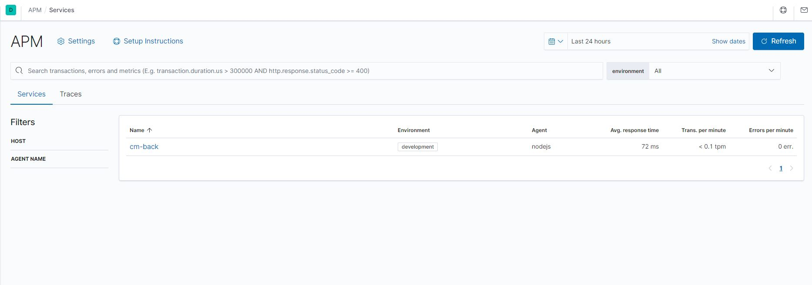
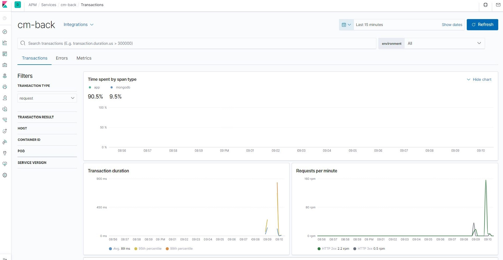

| [Home](https://techlipe.github.io/Workshop-Zero-To-Hero) | [Dia 01](https://techlipe.github.io/Workshop-Zero-To-Hero/dia01-configuracoes) | [Dia 02](https://techlipe.github.io/Workshop-Zero-To-Hero/dia02-observabilidade) | [Dia 03](https://techlipe.github.io/Workshop-Zero-To-Hero/dia03-elasticsearch) | [Dia 04](https://techlipe.github.io/Workshop-Zero-To-Hero/dia04-logstash) | [Dia 05](https://techlipe.github.io/Workshop-Zero-To-Hero/dia05-kibana) | 

# Workshop Elastic - Zero to Hero (Dia 2)
* **Criado por:** Felipe Queiroz e Anselmo Borges <br>
* **Última atualização:** 30.03.2020


Fala pessoal! Sejam muito bem vindos ao nosso Dia 02 de Workshop de Zero to Hero com toda a Elastic Stack. Hoje vimos como funciona o conceito de observabilidade e como consumir métricas e logs de algumas aplicações como Apache Web Server e as métricas do próprio docker que está rodando nossos serviços. Além também de implementarmos uma solução para visualizarmos um pouco como funciona o Elastic APM.


## Configurando o Metricbeat para monitorar os containeres
**Baixar o pacote do metricbeat**
```
cd ~
curl -L -O https://artifacts.elastic.co/downloads/beats/metricbeat/metricbeat-7.6.1-x86_64.rpm
sudo rpm -vi metricbeat-7.6.1-x86_64.rpm
```

**Habilitar modulos docker no Metricbeat**
```
sudo metricbeat modules enable docker
```

**Subir os templates de Dashboard pro Kibana e Inicializar o Serviço**
```
sudo metricbeat setup
sudo service metricbeat start
```

## Instalando HTTPD e Monitorando métricas e logs do Apache
**Instalando o Apache (HTTPD) e Verificando o Monitoramento Padrão http://seuipexterno/server-status**
```
sudo yum install httpd -y 
```
**Inicializando o Serviço do Apache**
```
sudo service httpd start
```

**(CURIOSIDADE) server-status do Apache - Adicionar no arquivo httpd.conf o seguinte trecho**
```
sudo vim /etc/httpd/conf/httpd.conf

<Location /server-status>
    SetHandler server-status
    Allow from SEUIP
</Location>
```
**Graceful no Serviço do Apache**
```
service httpd graceful
```

**Habilitando Modulo do Apache no Metricbeat**
```
sudo metricbeat modules enable apache
```

**Reiniciar Serviço do Metricbeat**
```
sudo metricbeat restart
```

## Laboratório de APM
**Clonar o repositorio do .git da aplicação modelo para a home do seu usuário**
```
cd ~
git clone https://github.com/techlipe/cm.git
```

**Instalar o pacote npm e as dependências da aplicação**
```
curl -sL https://rpm.nodesource.com/setup_10.x | sudo bash -
sudo yum install nodejs
npm istall
```
Obs: Ao instalar as dependências já estamos instalando o agente do APM da Elastic na aplicaçao. O mesmo deve e é referenciado no início da aplicação. Abaixo o trecho do código para fins didáticos. 
```
var apm = require('elastic-apm-node').start({
    serviceName: 'cm-back',

    secretToken: '',

    serverUrl: 'http://localhost:8200/'
  });
```

**Baixar e instalar o APM Server **
```
cd ~
curl -L  -O https://artifacts.elastic.co/downloads/apm-server/apm-server-7.6.2-x86_64.rpm
sudo rpm -iv apm-server-7.6.2-x86_64.rpm
```

**Iniciar o serviço e aplicação**
Vamos agora inicializar o APM server com as configurações padrões e também a nossa aplicação NODEJS
```
sudo service apm-server start
cd cm
npm start
```

**Realizar consultas na aplicação**
Realizar consultas e inserções em:
```
http://seuip:3000
```

**Acessar o meno de APM na console do Kibana e verificar a nossa aplicação sendo monitorada!**
Aplicação

Requisições

